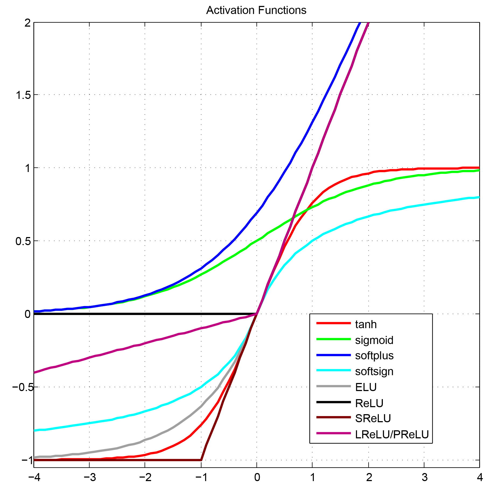

##Activation Functions

简单整理了一下目前深度学习中提出的激活函数，按照激活函数是否可微的性质分为3类：

 - 平滑非线性函数（Smooth nonlinearities）:
 
  - **tanh** : [Efficient BackProb, Neural Networks 1998](http://yann.lecun.com/exdb/publis/pdf/lecun-98b.pdf)
  $$f(x) = \frac{e^x-e^{-x}}{e^x+e^{-x}}$$
  - **sigmoid**: [Efficient BackProb, Neural Networks 1998](http://yann.lecun.com/exdb/publis/pdf/lecun-98b.pdf)
  $$f(x) = \frac{1}{1+e^{-x}}$$
  - **softplus**: [Incorporating Second-Order Functional Knowledge for Better Option Pricing, NIPS 2001](http://papers.nips.cc/paper/1920-incorporating-second-order-functional-knowledge-for-better-option-pricing.pdf)
  $$f(x) = ln(1+e^x)$$
  - **softsign**:
  $$f(x) = \frac{x}{|x| + 1}$$
  - **ELU**: [Fast and Accuracy Deep Network Learning by Exponential Linear Units, ICLR 2016](https://arxiv.org/pdf/1511.07289v5.pdf)
  $$f(x)= \begin{cases}  \begin{array}{lcl}
  x                 & & ; x>0 \\
  \alpha(e^x - 1) & & ; x \leq 0， \alpha = 1.0 \\
\end{array} \end{cases}$$

 - 连续但并不是处处可微（Continuous but not everywhere differentiable）

  - **ReLU**: [Deep Sparse Rectifier Neural Networks, AISTATS 2011](http://jmlr.org/proceedings/papers/v15/glorot11a/glorot11a.pdf) 
  $$f(x) = max(0, x)$$
  - **ReLU6**: [tf.nn.relu6](https://www.tensorflow.org/api_docs/python/tf/nn/relu6)
  $$f(x) = min(max(0, x), 6)$$
  - **SReLU**: Shift Rectified Linear Unit
  $$f(x) = max(-1, x)$$
  - **Leaky ReLU**: [Rectifier Nonlinearities Improve Neural Network Acoustic Models, ICML 2013](http://web.stanford.edu/~awni/papers/relu_hybrid_icml2013_final.pdf)
  $$f(x) = max(\alpha x, x), \alpha =0.01 $$
  - **PReLU**: [Delving Deep into Rectifiers: Surpassing Human-Level Performance on ImageNet Classification, arXiv 2015](https://arxiv.org/pdf/1502.01852.pdf)
  $$f(x) = max(ax, x), a\in [0,1), \alpha \text{ is learned}$$
  - **RReLU**: [Empirical Evaluation of Rectified Activations in Convolution Network, arXiv 2015](https://arxiv.org/pdf/1505.00853.pdf)
  $$f(x) = max(\alpha x, x), \alpha \text{~} U(l, u), l<u \ and \ l, u \in[0, 1)$$
  - **CReLU**: [Understanding and Improving Convolutional Neural Networks via Concatenated Rectified Linear Units, arXiv 2016](https://arxiv.org/pdf/1603.05201v2.pdf)
  $$f(x) = concat(\text{relu}(x), \text{relu}(-x))$$

 - 离散的（Discrete）

  -  **NReLU**: [Rectified Linear Units Improve Restricted Boltzmann Machines, ICML 2010](https://www.cs.toronto.edu/~hinton/absps/reluICML.pdf) 
  $$f(x) = max(0, x+\mathcal{N}(0, \sigma(x)))$$
  - **Noisy Activation Functions**: [Noisy Activation Functions, ICML 2016](https://arxiv.org/pdf/1603.00391v3.pdf)

-----
简单绘制部分激活函数曲线：

-------

**References**:

 - http://cs224d.stanford.edu/lecture_notes/LectureNotes3.pdf
 - https://www.tensorflow.org/api_guides/python/nn
 - http://www.cnblogs.com/rgvb178/p/6055213.html
